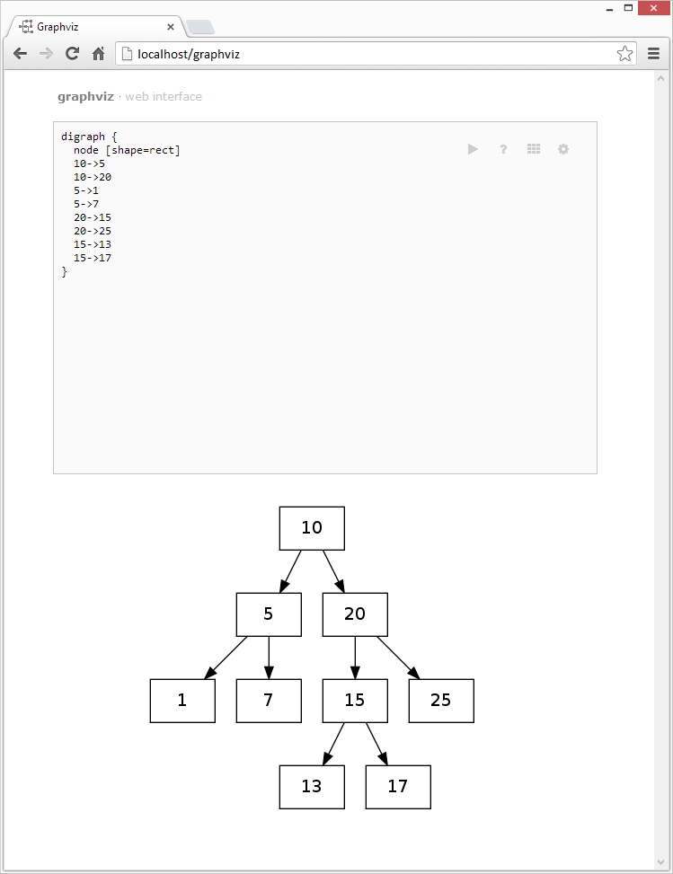

Graphviz Web Interface
======================

The code here provides a simple web-interface for [graphviz](http://www.graphviz.org/ "Graphviz") - a popular set of tools for graph drawing!

###### Pre-requisites

* Web server running PHP
* Local installation of graphviz (`sudo apt-get install graphviz` for Ubuntu/Debian)

###### Usage

Clone this repository on your server root and you should be good to go:

```
cd $SERVER_ROOT
git clone https://github.com/forhadahmed/graphviz.git
```

Now just point your browser to `$SERVER_ROOT/graphviz`

###### Screenshot

<p align="center"></p>

